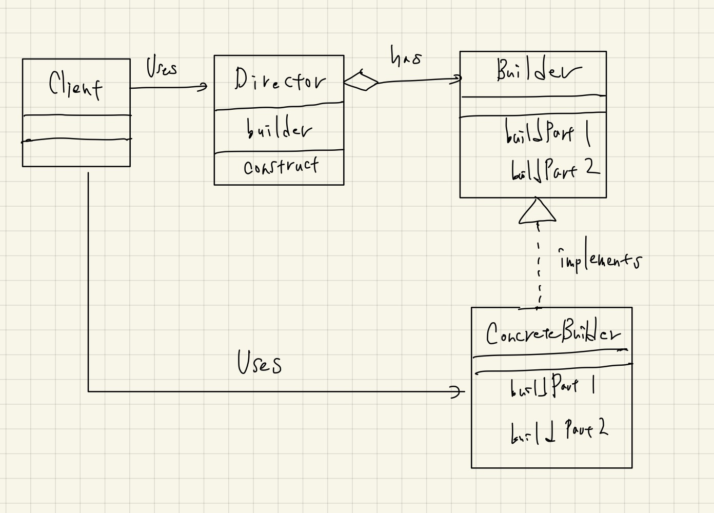

# Builder

- やはりTemplate Method, Factory Methodパターンに似ている。
  - Directorがinterfaceを持っていて、そのメソッドを用いて処理のテンプレートを形作っている。
  - Template MethodやFactory Methodパターンが、自身たらしめるポイントは、抽象クラス内にテンプレートを持っているかどうか？というところにあると考えるのが自然っぽい。
    - 継承を封印しようと思うと、結局これらはすべて同じもののように見えてくる。
- 「Builder」という単語の意味はちゃんと考えて再認識したほうが良さそう。
  - Buildする人（er）だから、現場の大工さんみたいなイメージ。
    - なんかTextBuilderとかHTMLBuilderとかをイメージすると「材料」みたいなイメージを持ってしまっていたが、実際には「材料を使って組み立てる人」というのが正しいイメージだと思う。
- 「Director」は大工に指示を出す人。
- このパターンも、やはり「振る舞いの抽出」が大事。
  - 「何らかを作成するために必要な共通の振る舞い」を抽出したい。
  - 構造の共通部分に注目し、差分はなにか？とかを考えるとよいのかも。
- Factory MethodやPrototypeよりは汎用性が高いかも？とはなんとなく感じる。

## クラス図

