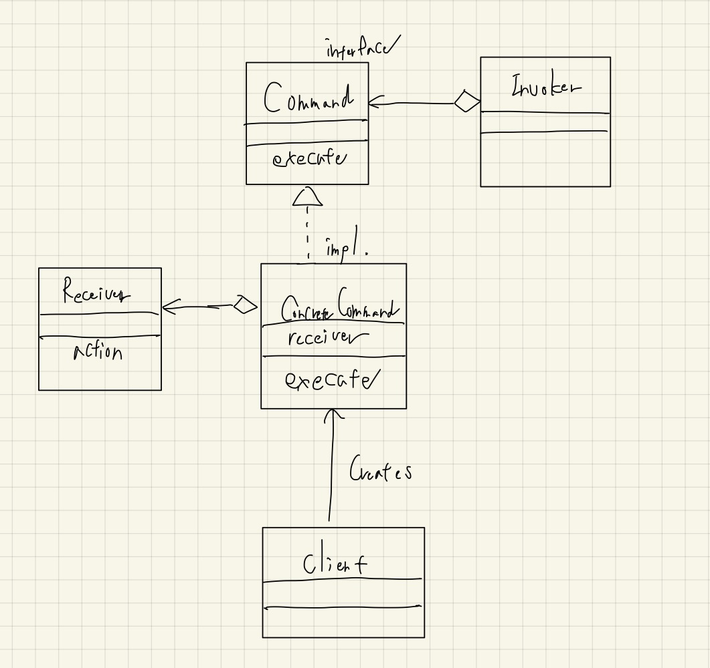

# Command

- Stateのように、「コマンド」という形無いものをクラスと見立てている。
  - **なのでStateと同じくちょっと複雑で難しいし、ピンポイントなパターンだと思う。**
- コマンドは `execute` というメソッドを持つのがポイント（インターフェースで抽象化できる）。
- マクロコマンドもコマンドのインターフェースを実装しておくことで、「コマンドの集合」も1つのコマンドとして扱うことが出来る。
  - これに関してはCompositeパターンが応用されている。
- 結城先生の本のサンプルはちょっと複雑なので、[monochromeganeさんのサンプル](https://github.com/monochromegane/go_design_pattern/tree/master/command)を写経してみる。

## クラス図

## [フロントエンドのデザインパターン: コマンドパターン](https://zenn.dev/morinokami/books/learning-patterns-1/viewer/command-pattern)

> Pros  
> コマンドパターンにより、ある操作を実行するオブジェクトから、 **メソッドを切り離すことが出来ます** 。
> **これは、特定の寿命をもつコマンドや、特定の時間にキューに入れられ実行されるようなコマンドを扱う場合に、より細かな制御を可能とします。**

> Cons  
> コマンドパターンのユースケースは非常に限られています。
> また、不要なボイラープレートをアプリケーションに追加してしまうことも少なくありません。

やはり、使い所は限られるっぽい。

