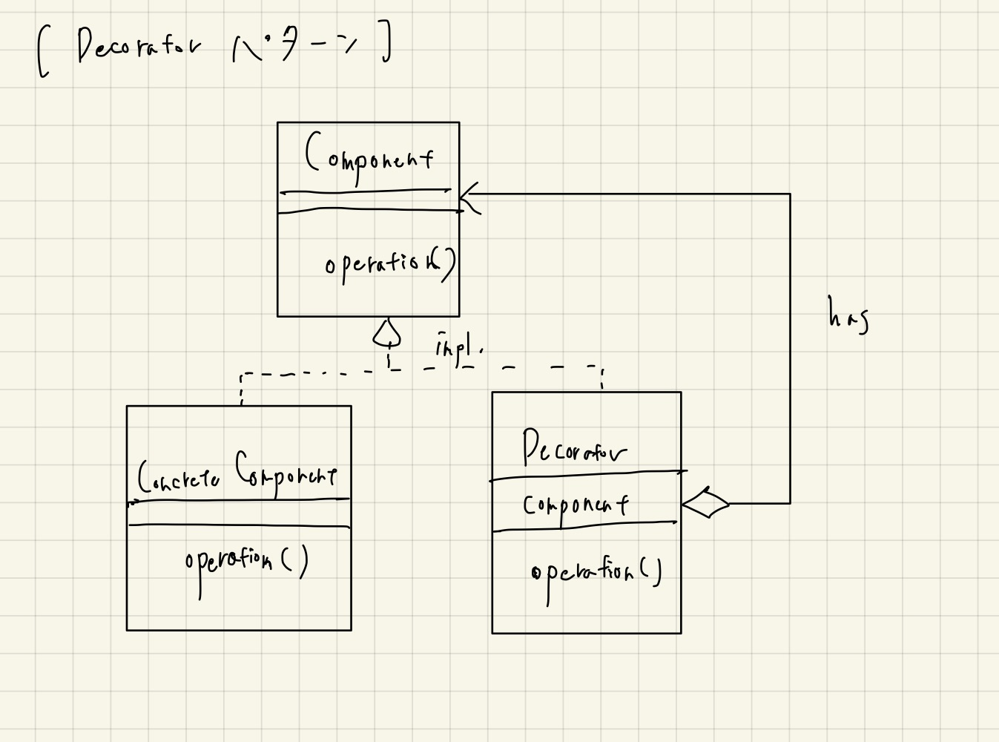

# Decorator

- TECHSCOREさんで例示されているパターンはわかりやすい。
- Strategyパターンのように、委譲で作れるパターンなので、汎用性は高そう
- Pythonのデコレータとかもコンセプトは同じだと思うが、あちらは関数オブジェクト（クロージャ）に閉じているので、より軽量だと思う
  - 念頭に置いておくと、割と気軽に適用できる機会は転がっていそう
  - クラスが乱立することもない
- 結城先生の本の例は、実装すべきメソッドの数が多いので、ちょっとポイントがぼやけやすい、と思う
  - それでも考え方のヒントは参考になる
  - Javaのioパッケージで使われている、という例も言及されている

## 結城先生の本からポイントを列挙

### 役割

- Component
  - 修飾される、デコレーションされる対象のインターフェース
  - コアの機能を定める
  - Icecream型
- ConcreteComponent
  - 実際にデコレーションされるもの、Componentを実装する
  - VanillaIcecream, GreenTeaIcecream型
- Decorator, ConcreteDecorator
  - 同じくComponentインターフェースを実装する
  - Goなどでは抽象クラスはないので、ConcreteDecoratorしか存在しない（はず）

### 考え方のポイント

- 登場人物すべてがComponentインターフェースを実装する
  - つまり「Componentと同一視される」
  - DecorateしたものをさらにDecorateする、というようなこともできる
    - つまり、Compositeパターンのような再帰的な構造を内包する
- 中身を変えずに、機能追加ができる
  - 包まれる側を修正する必要がないので、オープンクローズドの原則が守られている
- 委譲（has）のパターンが使われている

## Pythonなどのデコレータについて

- 関数だけに閉じているので、かなりコンパクトに機能拡張ができる
  - ファーストクラス関数を扱う言語も多いし、最近ではこちらのほうが圧倒的に重要な気がする
- 「処理前に共通形式でログ出力する」というのはあるあるかもしれない
- 業務上、共有リソースがロックされているかどうかを気にする必要がある処理群があったため、デコレーション用の関数を作ってみた。
  - 似たような例外を送出させるデコレータ、というのもひょっとしたらアリかもしれない？
- 関数のデコレーションが有用なケース
  - 外部ライブラリから関数の振る舞いを拡張すること（もともとの関数自体を変更できないため）
  - デバッグ目的（デバッグは一時的なものだからコードを変更したくない）
- DRY原則を実現するために、コードを毎回書き換えずに、同じコードで複数の関数を拡張するために、デコレータは有用

## 参考

- [TECHSCORE Decoratorパターン](https://www.techscore.com/tech/DesignPattern/Decorator.html/)
- [Pythonのデコレータ（decorator）を理解する1](https://xef.hatenadiary.org/entry/20120523/p1)
- [Pythonのデコレータ（decorator）を理解する2](https://xef.hatenadiary.org/entry/20120524/p1)
- [Pythonのデコレータ（decorator）を理解する3](https://xef.hatenadiary.org/entry/20120610/p1)
  - 元ネタの英語の記事は[こちら](https://xef.hatenadiary.org/entry/20120523/p1)
  - 1,2まではシンプルで3のパターンは応用。
- [Pythonのデコレータを理解するための12Step](https://qiita.com/_rdtr/items/d3bc1a8d4b7eb375c368)
  - 元ネタの英語の記事は[こちら](http://simeonfranklin.com/blog/2012/jul/1/python-decorators-in-12-steps/)

## クラス図

