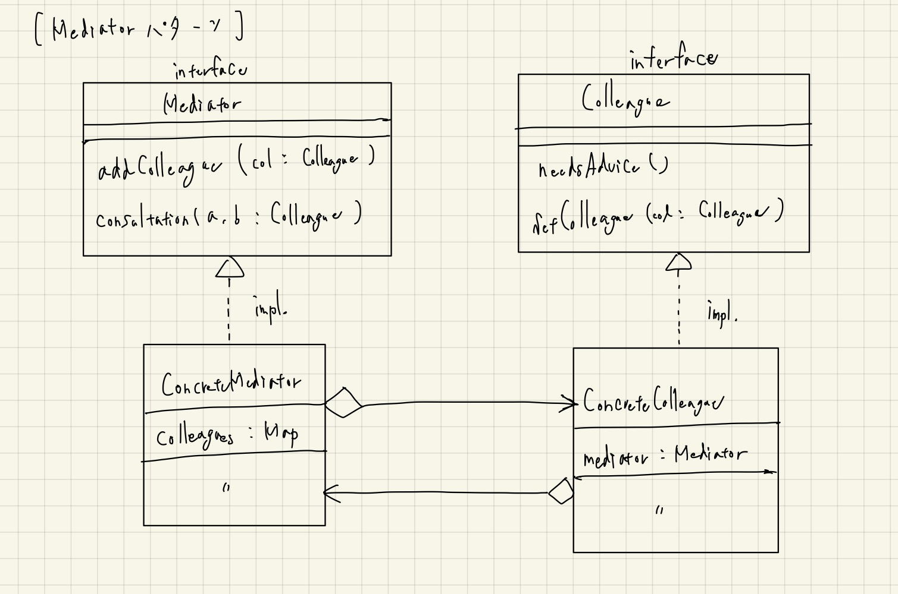

# Mediatorパターン

- Mediatorは「仲裁人、調停者」を意味する。
- 「多数のオブジェクトの間の調整を行いながら処理をすすめる必要がある場合に利用すると威力を発揮する」パターン。
- TECHSCOREさんの以下の例は確かにあるあるかもと思った。

> Mediatorパターンは、入力インターフェースなどに利用することができるでしょう。
> 例えば、「複雑に絡み合ったある条件を満たさなければ「有効」にならないボタン」なんてものを作成したいときは
> Mediatorパターンを思い出すべきですね。

以下は実装の詳細の説明など。

- `needsAdvice` は、自身が持っている `mediator` の `consultation` メソッドを呼ぶ。
  - つまり、委譲（コンポジション）の形。
- 必ずしも、それぞれの具象クラスに `mediator, colleague` のためのフィールドを持たせなくても、各メソッドに引数として持たせてもよいのかもしれない。
  - ただし、いずれにしても、依然として相互に依存は確実に存在し続ける。
- 「複数のものの状態の一元管理」っぽくも見えるので、抽象化せずによく使われている形式なのかもしれない。
  - 逆に、抽象化して再利用できるケースは余り思い浮かばない。。

## クラス図

