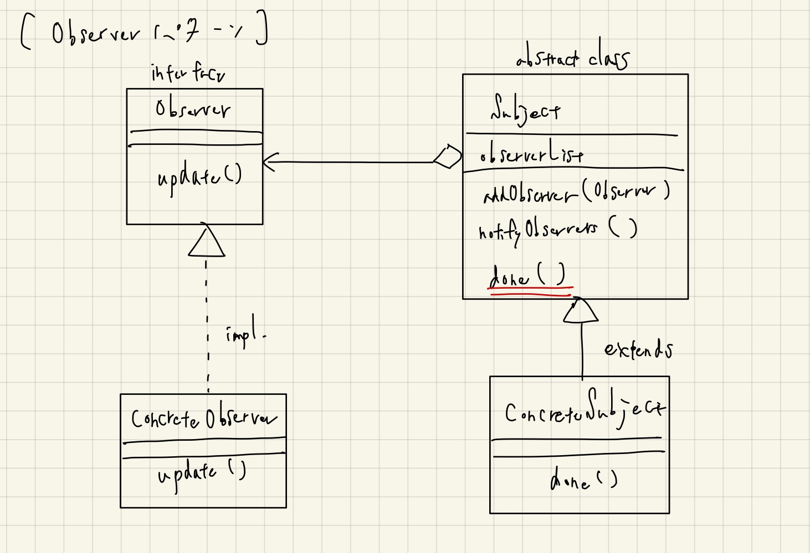

# Observer

- Observer（観察者、観測者）という名前だが、Subject（被験者）からの「通知（Notification）」が重要なパターン。
- JavaScriptのイベントループの仕組みがObserverパターンだと聞いたので、調べてみた。
- クラス図を見ればわかるが、以下のあたりがポイントかもしれない？
  - ObserverからSubjectに対する依存はなく、受動的に振る舞う
  - SubjectはObjectを知っており（≒依存しており）、Subjectのメソッドから連鎖的に `done -> notifyObservers -> (Observerの)update` という流れでメソッドが呼ばれる。
- 非同期処理などでは頻出しそうに思える（競合などの非同期特有の問題には注意が必要だろうけど）。
- とはいえ、最初からインターフェースにしておくのも難しそうな気もする。
  - 「通知」と「通知を受けての振る舞い」という流れが一種のパターン、ぐらいに捉えておく。

## クラス図

