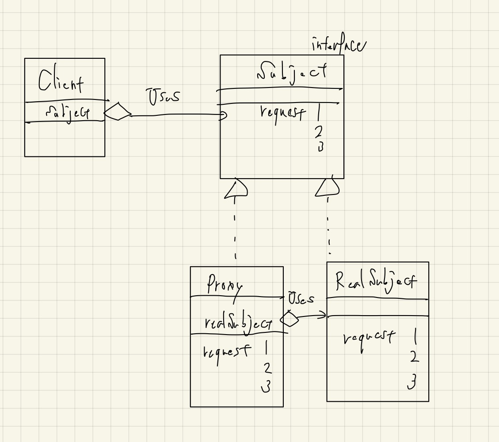

# Proxy

- 難しくはないけど、本質がどこにあるのかがわかりにくいパターンな気がする。多分全部大事なんだろうけど。
  - Proxy: 代理人、つまり「代わりに応答するもの」
    - インターネットの世界でもプロキシ、リバースプロキシと、アーキテクチャレベル（？）のパターンとなっている。
  - 遅延評価: 時間がかかる処理は必要になってから初めて行う。
  - 利用者目線: クライアントとしてはinterfaceとして疎にhasしたいのだと思う。
- 実際に採用するときは、「利用者側は抽象型を介して用いる」点に注意したい。
  - ここまで含めてのProxyパターンだと理解しておく。
  - よくよく考えると**「利用者はProxyの存在など意識しない」**。
- メソッドがRequest、問い合わせ先がSubject（主体）だったりする部分は重要。
  - SubjectよりはRespondentとかのほうがいい気もするけど。

## クラス図

