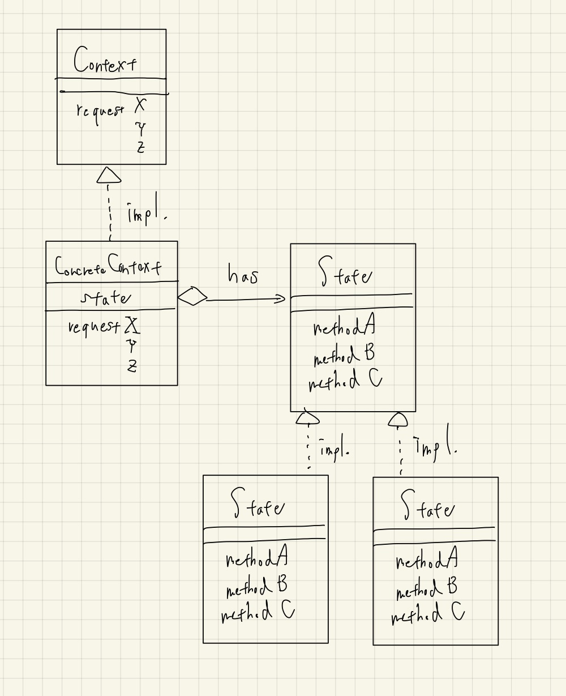

# State

- まず「状態という形ないものをクラスとして扱う」というのが1つ大きな功績であると思う。
  - その他の「形無いもの」に対しても応用が出来る、かもしれない。
- UML図を見た感じは、Strategyパターンにそっくり。
  - ただし、StateパターンにおいてはContextと呼ばれる、Stateオブジェクトを組み込んで利用するクラスの存在意義が大きいように思われる。
    - イベント駆動型のプログラムなどでは、このContextの存在も強く認識する必要があると思う。
  - よくよくコード例を読むと、Strategyパターンよりもメソッドシグニチャなどが複雑。
    - 具体的なStateクラスのメソッドにContextを渡しているところとか。
    - Contextの実装クラスでステートを管理する必要があるので自然とそうなるのだが、結構難しいのでStateパターンを実装したいときはちゃんとドキュメントを見ながら実装しよう。
- ポリモーフィズムにより、if文の乱発を防ぐことが出来る。
  - 「オープンクローズドの原則」の遵守につながる。
- メモリ節約のため、結城先生の本ではSingletonパターンが採用されているが、これは一旦忘れても良いかも？
  - Singletonパターンは忘れても良いとされているが、正直ちょこちょこ見かける気がする。。
- 結城先生の例はGUIでちょっと複雑なので、ここは[monochromegane/go_design_pattern](https://github.com/monochromegane/go_design_pattern/tree/master/state)から例を拝借する。
  - また、 `dayState, nightState` はそれぞれSingletonパターンも採用しているが、自分のコード例ではStateパターンに集中したいので、あえて都度ポインタ型でインスタンスを生成するようにしている。
- サンプルを写経してから思ったが、Contextをわざわざインタフェースにする必要はあるのだろうか？
  - 最初から具象クラスでContextを表現してしまってもいい気がする。
    - 実際、[TECHSCOREさんのStateパターンの例](https://www.techscore.com/tech/DesignPattern/State.html/)では、Contextは具象クラスしか用意していない。
  - どうも、Contextの具象クラスが他のクラスも継承する必要がある場合に難がある可能性があるっぽい？
    - いきなりinterfaceまで抽象化する必要はないのかもしれないが、「原典ではContextもinterfaceである」ということは認識しておく。
- **結論: Stateパターンは結構複雑で難しい。**

## クラス図

