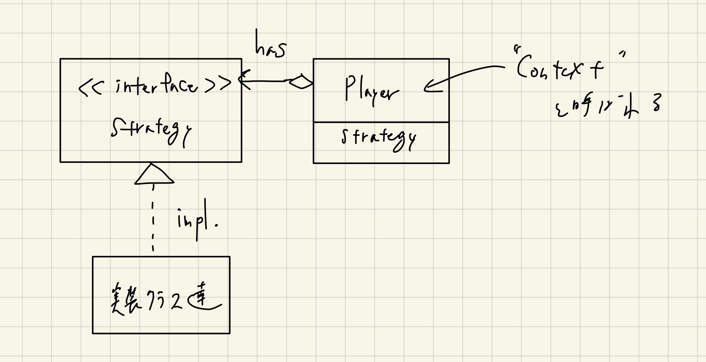
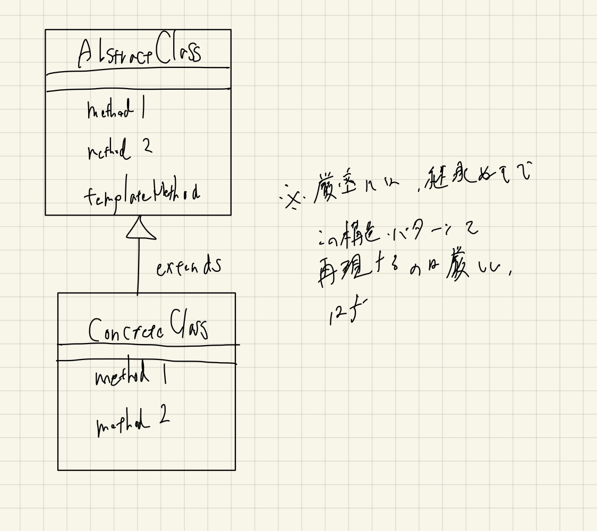

# Strategy

- DIを利用した最も基本的なパターンだと思う。
- DDDとかのソフトウェアアーキテクチャの分野だと、「DIは下位レイヤへの依存を外部から注入することでテスタブルにする」という目的が主だと思うが、デザインパターンでも頻出している。
- 振る舞いが単一の場合は、Goなど最近の言語では関数オブジェクトを利用して注入するのが簡単だと思う。
- 振る舞いが複数ある場合は、interfaceを定義し実装クラスを用意し、それらのインスタンスを注入してやる。
  - **これによって、実質的に「このパターン例はTemplate Methodパターンも説明している」ことになる。**
    - サンプルの `Player` 構造体の `Do` メソッドがTemplate Methodパターンに他ならない。
- Strategyパターンの利用方法は、Template Methodライクなものに限られるわけではない、という点は注意が必要。
  - じゃんけんの戦略をStrategyパターンにすれば、Template Methodとは異なったものになる。
- 結城先生の本によると、「Template Methodパターンは継承を、Strategyパターンは委譲を用いる」という点自体が大きな特徴である、とのこと。
  - 実用上は忘れても構わないかもしれない。

## クラス図

